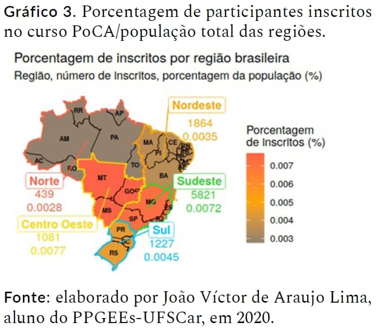

# Visualizations of participant data from a distance learning course
 ## Languages
 This first section is in English. 
 
 [Versão em português logo abaixo.](#portuguese)
 
 ## Context
 My participation in this project started with a request from the lead researcher to analyze some data collected from a course developed on the [Open Courses Portal - PoCA](https://poca.ufscar.br/pt-br) entitled "**Introdução aos Estudos da Língua Brasileira de Sinais** (in English: *Introduction to Studies of Brazilian Sign Language*)".

To do this, she provided me with some information about the course, as well as some Excel spreadsheets ```.xlsx``` with information about the course participants and their satisfaction with the course.

The objective was to analyze the course by region in Brazil, to assess how the course was performing in the country in general and which regions had the most participants in the course. To do this, I decided to perform the processing and visualization using programming languages.
 
 ## Confidentiality of data and code
As this data and code are part of a larger research project and as I am not responsible for it, I have only posted some visualizations to show a little of the path taken for the analyses, but without disclosing the complete work out of respect for the work of my colleagues.

## Visualizations of this project
For the published work, three graphics were chosen to make it into the final publication.

1. The first was to have a general overview, with a plot of the total number of participants for each Brazilian state

<p align="center">

</p>

2. The second visualization shows the percentage (of the total population, according to the 2010 Brazilian Demographic Census) of course participants by state within each Brazilian region

<p align="center">

</p>

3. Since the most important visualization was by region of Brazil, the final graph was plotted on the map with color legend by percentage of people enrolled in the course, with the Central West as the most enrolled region of the total population percentage, followed by the Southeast.

<p align="center">

</p>
 
 ## How to access this material
A more detailed view of this work was published in the book chapter called "**Introdução à Libras em Ambiente Virtual de Aprendizagem: análises de um curso aberto e gratuito** (in English: *Introduction to Libras in a Virtual Learning Environment: analysis of an open and free course*)" in the book "**[Educação a Distância, formação de professores e ensino na diversidade](https://www.edesp.ufscar.br/arquivos/livros/e-book-educacao-a-distancia-formacao-de-professores-e-ensino-na-diversidade.pdf)** (in English: *Distance Education, teacher training and teaching in diversity*)".
 ## Technologies used
In this project, the ```R``` statistical programming language and ```Jupyter Notebooks``` were used to access and document the codes.
 
 ____
 <br>
 
 # <p id="portuguese">Visualizações dos dados dos participantes de um curso a distância</p>
 ## Contexto
 Minha participação neste projeto surgiu a pedido da pesquisadora líder para que fossem feitas análises de alguns dados coletados de um curso desenvolvido no [Portal de Cursos Abertos - PoCA](https://poca.ufscar.br/pt-br) entitulado "**Introdução aos Estudos da Língua Brasileira de Sinais**".

 Para isso ela me disponibilizou algumas informações sobre o curso, além de algumas planilhas do excel ```.xlsx``` com informações sobre os participantes do curso e de satisfação do curso.

 O objetivo era fazer uma análise por regiões do Brasil, para se avaliar como o curso estava desenpenhando no país em geral e quais as regiões que mais participaram do curso. Para isso, decidi realizar o tratamento e visualizações fazendo uso de linguagens de programação.
 
 ## Sigilo dos dados e código
 Como estes dados e códigos fazem parte de uma pesquisa maior e como não sou responsável por ela, postei somente algumas visualizações para mostrar um pouco do caminho adotado para as análises, mas sem divulgar o trabalho completo em respeito ao trabalho dos colegas.

 ## Visualizações deste projeto
 Para o trabalho final, três visualizações foram escolhidas para entrar na publicação final.

 1. A primeira era para se ter um panorama geral, com uma plotagem do total de participantes por cada estado brasileiro

<p align="center">
  
</p>

 2. A segunda visualização mostra a porcentagem (do total populacional, segundo o Censo Demográfico de 2010) de participantes do curso por estado dentro de cada região brasileira

<p align="center">
  
</p>

 3. Como a visualização mais importante era por região do Brasil, o gráfico final foi plotado sobre o mapa com legenda de cores por porcentagem de inscritos no curso, tendo o Centro Oeste como região mais inscrita da porcentagem total populacional, seguida do Sudeste.
 
<p align="center">
  
</p>

 ## Instruções de acesso
 Uma visão mais detalhada deste trabalho foi publicado no capítulo de livro chamado "**Introdução à Libras em Ambiente Virtual de Aprendizagem: análises de um curso aberto e gratuito**" no livro "**[Educação a Distância, formação de professores e ensino na diversidade](https://www.edesp.ufscar.br/arquivos/livros/e-book-educacao-a-distancia-formacao-de-professores-e-ensino-na-diversidade.pdf)**".
 
 ## Tecnologias utilizadas
 Neste projeto, foi utilizado a linguagem ```R``` de programação estatística e ```Jupyter Notebook``` para acesso e documentação do código.